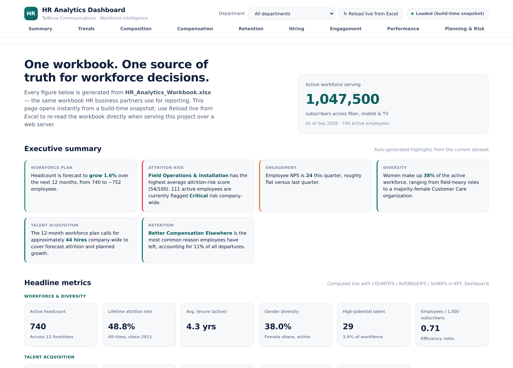
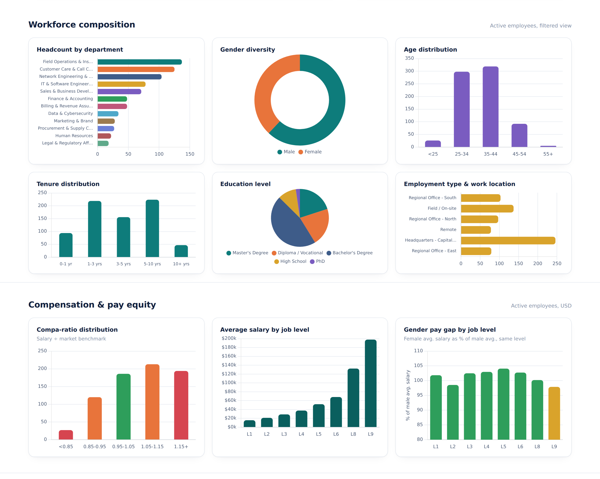
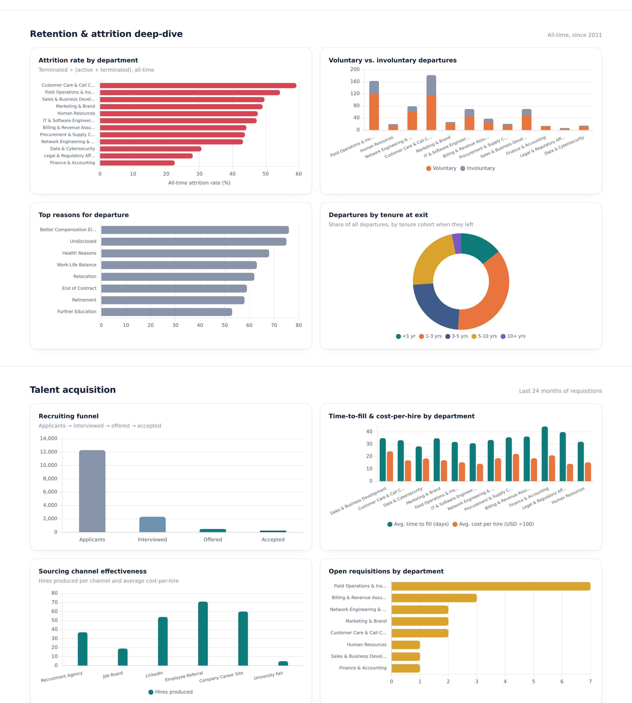
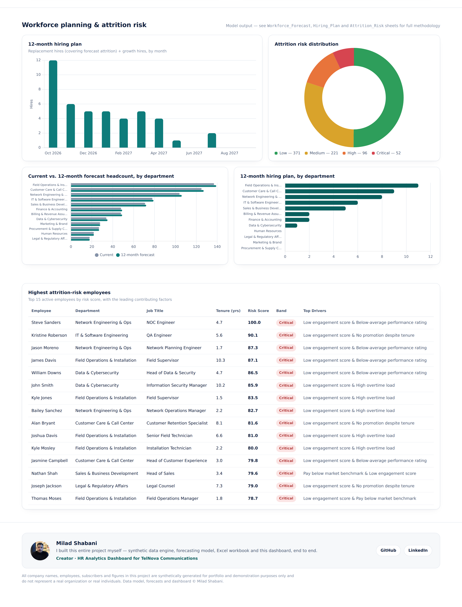

# HR Analytics Dashboard

**A full-stack HR / People Analytics project** built around a fictional telecom & ISP operator, TelNova Communications — synthetic data engineering, statistical workforce forecasting, an explainable attrition-risk model, and a live, formula-driven Excel workbook rendered in a self-contained interactive HTML dashboard.

> Built as a portfolio project to demonstrate end-to-end HR analytics: from raw data generation in Python, through a real Excel data model with live formulas, to a dashboard that opens with a single double-click — no database, no backend, no build step, no server required.

<p align="center"><strong>Milad Shabani</strong></p>

---

## Dashboard preview

<p align="center">
  <br>
  <em>Executive summary and headline metrics — auto-generated insights plus 17 KPIs across workforce, hiring and engagement.</em>
</p>

<p align="center">
  <br>
  <em>Workforce composition (department, gender, age, tenure, education) and compensation & pay-equity analysis (compa-ratio, salary by level, gender pay gap).</em>
</p>

<p align="center">
  <br>
  <em>Retention deep-dive (attrition by department, departure reasons, tenure at exit) and talent acquisition (funnel, sourcing channels, time-to-fill).</em>
</p>

<p align="center">
  <br>
  <em>12-month workforce planning, attrition-risk distribution, the ranked risk table, and the project footer.</em>
</p>

*(Screenshots generated directly from the shipped dashboard — see [Quick start](#quick-start) to run it yourself.)*

---

## Why this project exists

Most "HR analytics" portfolio pieces are either a static Power BI screenshot or a Kaggle CSV with a few pivot tables. This project instead builds the **whole chain a real People Analytics function would own**:

1. A believable operating context — a converged telecom/ISP with **~1,047,500 subscribers** and **~740 active employees** across 12 business functions (network engineering, field operations, call center, IT, sales, finance, legal, and more).
2. A **synthetic-but-internally-consistent** HR dataset: hire/termination dates, compensation vs. market benchmark, performance, engagement, training, and 24 months of recruiting activity — all generated with reproducible statistical models, not random noise.
3. A **live Excel workbook** where headline KPIs are real `COUNTIFS` / `AVERAGEIFS` / `SUMIFS` formulas against native Excel Tables — change a row of raw data and the KPIs recalculate.
4. A **documented workforce-planning and forecasting model**: 12-month headcount forecasting, attrition-rate forecasting (Holt's exponential smoothing), a resulting hiring plan, and an explainable, auditable individual attrition-risk score — the kind of model a real HRBP could defend in a business review, not a black box.
5. A **dashboard generated from that Excel file** — the workbook's data is embedded directly into the HTML at build time, so the file opens instantly with a plain double-click, in any browser, with zero setup. An optional one-click **"Reload live from Excel"** re-parses the actual workbook in the browser whenever the project is served over http/https, so the workbook can still act as the single source of truth on demand.

---

## The dashboard

`dashboard/index.html` is a **single, self-contained HTML file** — no server, no framework, no npm install, no CORS issues, no missing-file errors. `scripts/export_dashboard_data.py` bakes the finished workbook's data directly into that file at build time, so opening it (by double-click, from a USB stick, attached to an email, anything) always works.

Nine sections, ~30 charts and a ranked risk table:

- **Executive summary** — auto-generated, plain-language highlights (headcount trajectory, highest-risk department, eNPS momentum, top departure reason, hiring plan size)
- **Headline metrics** — 17 KPIs grouped into Workforce & Diversity, Talent Acquisition, and Engagement/Compensation/Learning
- **Headcount & attrition trends** — 36 months actual + 12-month statistical forecast
- **Workforce composition** — department, gender, age bands, tenure distribution, education, employment type & work location
- **Compensation & pay equity** — compa-ratio distribution, average salary by job level, gender pay gap by level
- **Retention & attrition deep-dive** — attrition rate by department, voluntary vs. involuntary split, top departure reasons, tenure-at-exit distribution
- **Talent acquisition** — recruiting funnel, time-to-fill/cost-per-hire by department, sourcing-channel effectiveness, open requisitions by department
- **Engagement & learning** — eNPS/engagement trend, latest-quarter engagement radar, training hours & cost by category
- **Performance & talent** — a performance-vs-engagement map highlighting flagged high-potential talent, performance rating distribution, promotion rate and high-potential headcount by department
- **Workforce planning & risk** — 12-month hiring plan (company-wide and by department), current-vs-forecast headcount by department, attrition-risk distribution, and a ranked table of the highest-risk employees with *why* they're flagged

A department filter (top bar) re-slices every relevant chart live.

---

## Quick start

### 1. Generate the dataset, build the workbook, and embed dashboard data

```bash
pip install -r requirements.txt
python scripts/build_all.py
```

This runs the full pipeline:

| Step | Script | What it does |
|---|---|---|
| 1 | `scripts/generate_hr_data.py` | Synthesizes employees, recruitment, engagement surveys, training records and a 36-month headcount trend |
| 2 | `scripts/forecast_engine.py` | Builds the 12-month headcount/attrition forecast, hiring plan, and individual attrition-risk scores |
| 3 | `scripts/build_workbook.py` | Assembles the formatted, formula-driven `.xlsx` workbook |
| 4 | *(optional)* LibreOffice recalculation | Bakes cached formula values into the workbook if `soffice` is installed |
| 5 | `scripts/export_dashboard_data.py` | Embeds the workbook's data directly into `dashboard/index.html` |

### 2. Open the dashboard

Just double-click **`dashboard/index.html`** — it works immediately, no server required.

To use the live "Reload from Excel" button instead of the embedded snapshot, serve the project root:

```bash
python -m http.server 8000
```
Then open **http://localhost:8000/dashboard/** and click **"↻ Reload live from Excel."**

---

## Project structure

```
hr-analytics-dashboard/
├── scripts/
│   ├── generate_hr_data.py       # Synthetic data generation engine
│   ├── forecast_engine.py        # Workforce forecasting + attrition risk scoring
│   ├── build_workbook.py         # Excel workbook builder (formulas, tables, charts)
│   ├── export_dashboard_data.py  # Embeds workbook data directly into dashboard/index.html
│   └── build_all.py              # Runs the full pipeline in one command
├── data/
│   └── HR_Analytics_Workbook.xlsx  # Generated workbook (source of truth)
├── dashboard/
│   ├── index.html               # The dashboard — fully self-contained, data embedded at build time
│   └── assets/
│       └── milad-shabani.jpg    # Creator photo shown in the dashboard footer
├── docs/
│   └── preview-*.png            # Dashboard screenshots used in this README
├── .github/workflows/
│   └── deploy-pages.yml         # Auto-publishes the dashboard to GitHub Pages
├── publish_to_github.sh         # One-command script to push this repo to GitHub (macOS/Linux)
├── requirements.txt
├── LICENSE
└── README.md
```

---

## The data model

**Employees** (all-time roster, ~1,450 rows / ~740 currently active) — demographics, department, job level, hire/termination history, compensation vs. market benchmark, performance rating, engagement score, overtime, training hours, absenteeism, promotions.

**Recruitment** (24 months of requisitions) — source channel, applicants → interviewed → offered → accepted funnel, time-to-fill, cost-per-hire.

**Engagement_Survey** (8 quarterly pulse surveys) — overall engagement, eNPS, and five sub-dimensions (work-life balance, manager relationship, career growth, compensation satisfaction, culture & inclusion).

**Training** — course-level records with hours and cost, tied back to each active employee.

**Monthly_Trend** — 36 months of headcount, hires, terminations and subscriber base, reconstructed directly from employee hire/termination dates (not separately simulated, so it's always internally consistent with the roster).

**KPI_Dashboard** — every headline number as a live formula (`COUNTIFS`, `AVERAGEIFS`, `SUMIFS`) against the raw tables above.

**Workforce_Forecast / Dept_Forecast / Attrition_Forecast / Hiring_Plan / Attrition_Risk** — the forecasting layer, described below.

All monetary figures are in USD. All data is synthetic and reproducible (fixed random seed) — see [Data & ethics notice](#data--ethics-notice).

---

## The forecasting & planning task

This is the analytical core of the project: a **12-month, department-level workforce plan** built the way a People Analytics team would actually defend it — transparent methodology over black-box accuracy theater.

**1. Headcount forecast** — a linear-trend regression on the last 18 months of reconstructed headcount, blended 50/50 with a stated 6% annual strategic growth target, then allocated to departments by current headcount share.

**2. Attrition-rate forecast** — Holt's linear (double) exponential smoothing (α = 0.35, β = 0.25) fitted on 36 months of reconstructed monthly attrition rate, projected forward 12 months.

**3. Hiring plan** — for every department and month: `Planned Hires = Forecast Attrition (replacement) + Net Headcount Change Required (growth)`. This is the same replacement-plus-growth logic used in real annual workforce plans.

**4. Individual attrition-risk score** — every active employee scored 0–100 with a fully explainable weighted-factor model:

| Factor | Weight |
|---|---|
| Low engagement score | 26% |
| Pay below market benchmark | 20% |
| High overtime load | 14% |
| Tenure with no promotion | 13% |
| Below-average performance rating | 12% |
| Elevated absenteeism | 10% |
| Low training investment | 5% |

Scores are min-max scaled across this population (lowest scorer = 0, highest = 100) and bucketed into Low / Medium / High / Critical bands set from this population's own 50th/80th/93rd percentiles, with the top two contributing factors surfaced per employee — so every score is auditable in one glance, unlike an opaque ML classifier.

Full methodology notes are written directly into each sheet of the workbook (`Workforce_Forecast`, `Attrition_Forecast`, `Hiring_Plan`, `Attrition_Risk`) so any reader can verify exactly how a number was produced.

---

## Publishing this repo

**macOS / Linux:**
```bash
chmod +x publish_to_github.sh
./publish_to_github.sh https://github.com/<your-username>/hr-analytics-dashboard.git
```

Once pushed: **Settings → Pages → Source → GitHub Actions**. The included workflow (`.github/workflows/deploy-pages.yml`) builds and publishes the dashboard automatically on every push to `main`.

> **First deploy shows "Failed to deploy"?** This almost always means the Pages *source* is still set to "Deploy from a branch" instead of "GitHub Actions" — a brand-new repo has no Pages site yet, so the very first API call to enable it must be a `POST`, not a `PUT`. Set it manually once in **Settings → Pages → Source → GitHub Actions**, then re-run the failed workflow from the **Actions** tab (**Re-run all jobs**) — it will succeed from then on.

---

## Data & ethics notice

Every employee, applicant, subscriber count and figure in this project is **synthetically generated** with a fixed random seed (`scripts/generate_hr_data.py`). TelNova Communications is a fictional company. No real persons, employees, or organizations are represented. This project is intended purely for analytics portfolio and educational demonstration purposes.

---

## Tech stack

- **Data engineering & modeling:** Python, pandas, NumPy, Faker
- **Workbook generation:** openpyxl (native Excel Tables, live formulas, conditional formatting, embedded charts)
- **Dashboard:** vanilla HTML/CSS/JS, [SheetJS](https://sheetjs.com/) for the optional live Excel reload, [Chart.js](https://www.chartjs.org/) for visualization
- **Deployment:** GitHub Actions → GitHub Pages

---

## Author

**Milad Shabani**
Creator — data model, forecasting engine, Excel workbook and dashboard, built end to end for this project.
